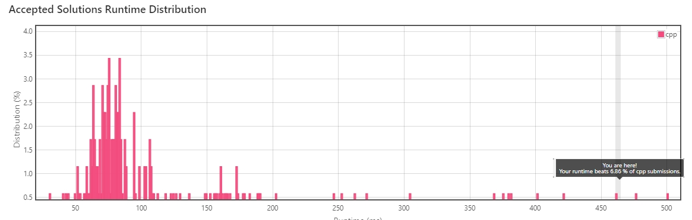
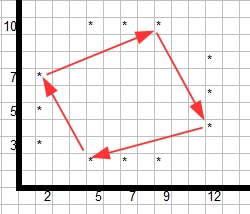
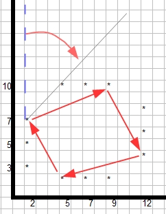
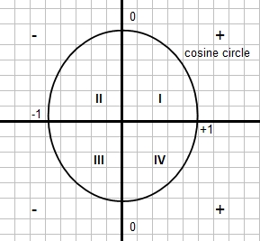
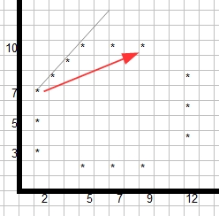
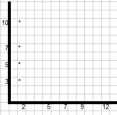

# Leetcode problem 587. Erect the Fence

# The problem
The problem can be found [here](https://leetcode.com/problems/erect-the-fence/).

>You are given an array trees where trees[i] = [xi, yi] represents the location of a tree in the garden.
Fence the entire garden using the minimum length of rope, as it is expensive. The garden is well-fenced only if all the trees are enclosed.
Return the coordinates of trees that are exactly located on the fence perimeter. You may return the answer in any order.

For the picture above
>Input: trees = [[1,1],[2,2],[2,0],[2,4],[3,3],[4,2]]

>Output: [[1,1],[2,0],[4,2],[3,3],[2,4]]

# My Solution - not optimal

<b>My solution is not optimal!</b>

I decided to 'invent the wheel' - develop my solution without trying to investigate first. I managed to do it and it turned out to be not the optimal one. In fact, Leetcode statistics showed it is quite bad:

Still, I wanted to keep it and share it for two purposes:
* it is not a good idea to 'reinvent the wheel'
* to boast my 'skills' :-) - to be able to track my progress in both learning algorythms and C++.

## Summary

First of all, if there are three trees or less, than all the trees must be included.

If there are more trees, than the logic below kicks in.

My idea was first to find most outstanding points : xmin, ymax, xmax and ymin (note, some of these points may coincide!). In case there are several points that meet criteria (for example, if minimum X = 1, than all following trees could be xmin: [1,1], [1,2], [1,3] etc. We select the one that would be the last when you walk around the forest clockwise (in this case xmin = [1,3]).

Next step would be to start walking the path xmin -> ymax -> xmax -> ymin -> xmin. Using convention <b>starting</b> -> <b>target</b> points (e.g. starting = xmin, target = ymax. Also using <b>next</b> as the next point in the path.

While walking around the forest (in this case clockwise), always choose the next tree to be most left one as you walk. Use calculated cosine of the vector (start -> next) and compare it with the refernce cosine of vector (starting -> target). There are several special cases that are taken into account.

Thus, there are four sections we need to walk.

To prevent duplicates, use std::map to store results. In the end, copy elements from the map to the output vector.

## Selecting Min and Max values:

First define Min/Max points. Choose most outstanding points if walking clockwise around the forest. In the picture below asterics (*) denotes a tree.
Thus, 
xmin = [2, 7];
ymax = [9, 10];
xmax = [12, 4];
ymin = [5, 1];

We than assign starting = xmin, target = ymax. Calculate cosine of vector (current -> target). This becomes our reference cosine. Then go over all the trees and check if cosine of vector (current -> next) is better that cosine of our reference vector. 

This can be depicted as if we were rotating a beam of light clockwise from starting point until we come across the first tree:

Now, depending on the quadrant you are measuring, a 'better' cosine may be either smaller or larger than reference (check cosine circle below). In case of xmin -> ymax we are in the I quadrant, so we are looking for the least cosine.

Once we find the next point, we reassign starting = next and recursively call the same search function until the next = target.

Then we proceed to the next pair of starting -> target trees. Thus, our path in terms of cosine circle quadrants will be I -> IV -> III -> II

There are special cases:

1. Several trees in line. In the picture below we come across points [3,8], [4,9] and [5,10] that all would have the same cosine and must be included in the fence. This case is taken care of.

2. All trees in horizontal/vertical lines. This is just the same case as case '1'.

## Testing

GoogleTests were added to test all the different test cases. Unit tests check functions for individual quadrants and Integration tests put it all together and check the complete solution.